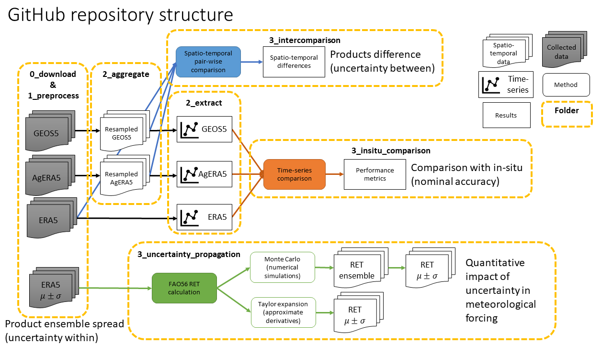
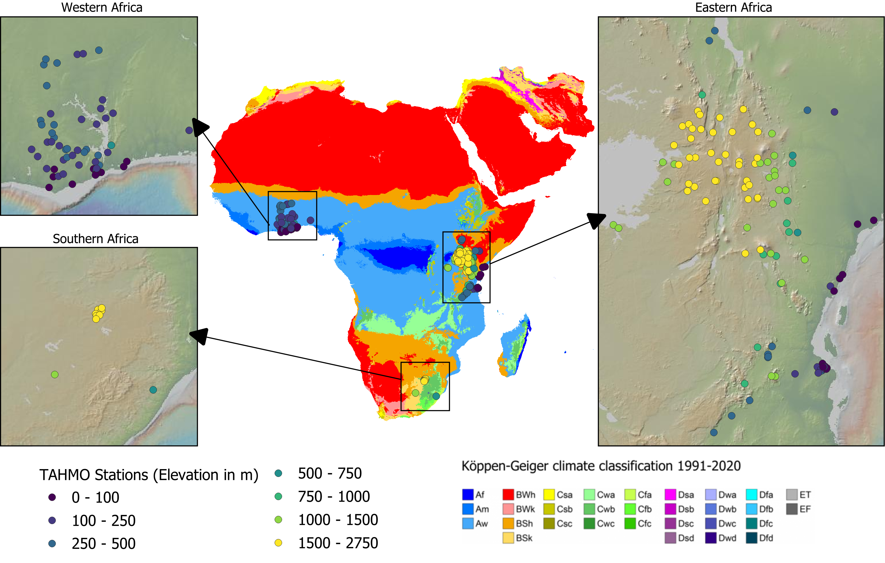

[](https://doi.org/10.5281/zenodo.13970799)

# ReanalysisMeteoRET

This repository provides jupyter notebooks with analyses for paper "Evaluation of reanalysis datasets as meteorological input for estimating reference evapotranspiration over Africa and the Near East" (Submitted to Hydrological Sciences Journal)

# Methods

In this study, we evaluated the meteorological input for RET from reanalysis data. 

Our assessment entails three components: uncertainty between products, nominal accuracy, and quantitative impact of uncertainty in inputs on RET.



The uncertainty between products was assessed by spatial and temporal pair-wise comparison. The nominal accuracy  was assessed by comparison with time-series data from in-situ measurements. Finally, the impact of uncertainty in inputs on RET was assessed by two error propagation methods (Monte Carlo simulations and Taylor expansion)

# Study area



# Data
- ERA5 data are accessible at [https://doi.org/10.24381/cds.adbb2d47](https://doi.org/10.24381/cds.adbb2d47). 
- AgERA5 data are accessible at [https://doi.org/10.24381/cds.adbb2d47](https://doi.org/10.24381/cds.adbb2d47). 
- GEOS5 data are accessible at [https://opendap.nccs.nasa.gov/dods/GEOS5/fp/0.25_deg/assim](https://opendap.nccs.nasa.gov/dods/GEOS5/fp/0.25_deg/assim). 
- TAHMO dataset is available on request to the data providers at https://tahmo.org/climate-data/

# Python environment
```
conda env create --file environment.yml
```

# Citation

Tran, B. N., Dehati, S., Seyoum, S., van der Kwast, J., Jewitt, G., Uijlenhoet, R., and Mul, M. (2024). Evaluation of reanalysis datasets as meteorological input for estimating reference evapotranspiration over Africa and the Near East (Version 1.0) [Code]. 
